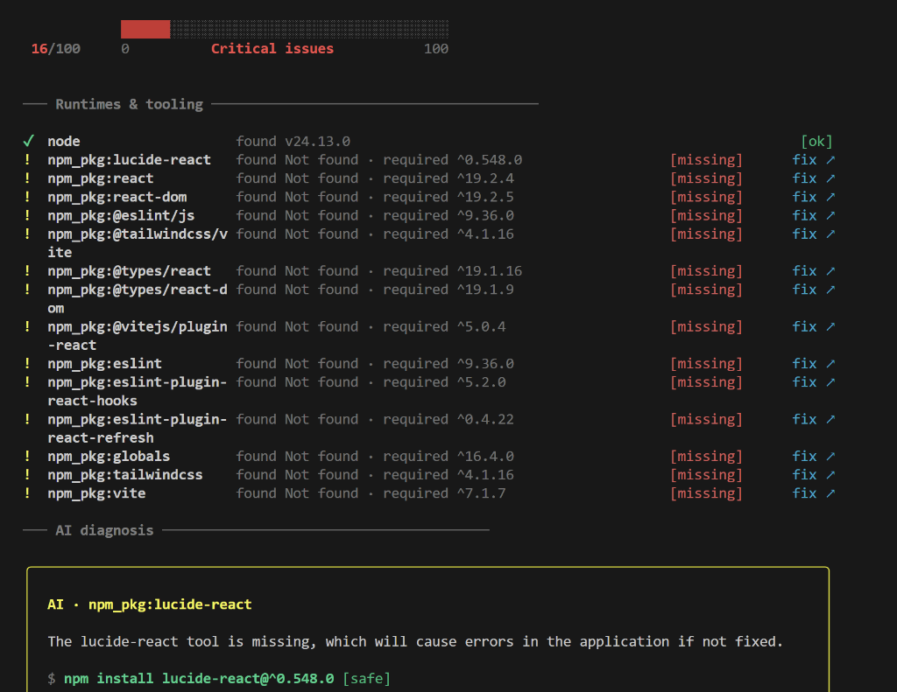
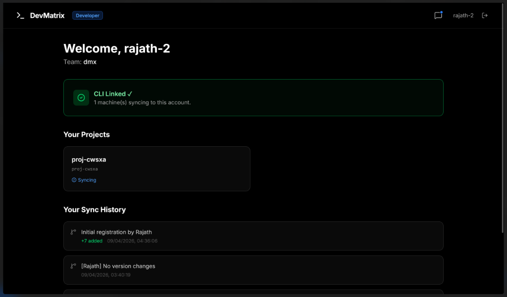
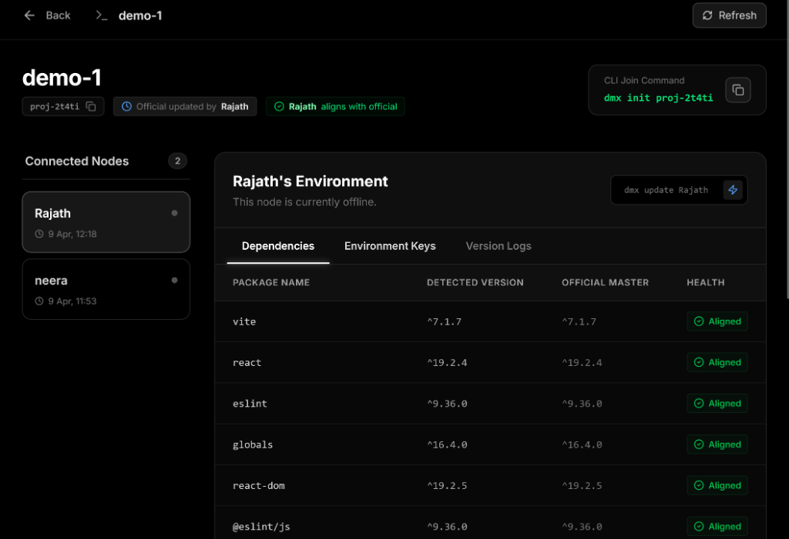

# DevMatrix (DMX) 🚀

**DevMatrix** is a production-grade environment diagnostician and team synchronization platform. It ensures that every developer on your team has a perfectly calibrated local environment, eliminating the "it works on my machine" class of bugs.


*DMX CLI providing real-time diagnostics and AI-powered remediation.*

---

## 🏗️ Project Architecture

DevMatrix is built as a TypeScript monorepo, separating core logic from delivery platforms:

- **`packages/cli`**: The high-performance Node.js tool powered by [Ink](https://github.com/vadimdemedes/ink).
- **`packages/extension`**: A VS Code sidebar integration for constant health monitoring.
- **`frontend/dmx-dashboard`**: A Next.js 15 collaborative web dashboard.
- **`packages/shared`**: Shared domain models and type safety across the stack.

### Data Flow & Engine
1. **Scanner**: Parallelized probes for system binaries, stack-specific requirements, and environment variables.
2. **Diff Engine**: A weighted scoring algorithm that compares your local state against project requirements.
3. **AI Advisor**: Context-aware remediation generated via Groq (Llama 3 / Mixtral) for complex setup issues.
4. **Cloud Sync**: Optional snapshot persistence to Supabase for team-wide version alignment.

---

## 🌐 Cloud Dashboard & Collaboration

DevMatrix is more than just a local tool. Visit [devmatrixcli.vercel.app](https://devmatrixcli.vercel.app/) to manage your team's configuration in the cloud.

| User Profile & Projects | Project Version Timeline |
| :--- | :--- |
|  |  |

### Cloud Sync Workflow
1. **Link Identity**: Run `dmx link <token>` to associate your machine.
2. **Push Snapshot**: Use `dmx logs push` to share your current working version.
3. **Team Align**: Teammates can run `dmx status` to see if they are out of sync with your working environment.

---

## 🛡️ Production Readiness & Security

DevMatrix is designed with security as a first-class citizen:

- **Local-First AI**: Your Groq API keys are stored only in `~/.devpulse/.env`. They never leave your machine; the CLI communicates directly with the AI provider.
- **Data Masking**: When syncing to the cloud, DMX automatically masks sensitive environment variable values, only sharing the *keys* to verify their presence.
- **Non-Interactive Fixes**: The `dmx fix` command uses a secure agentic runner to perform safe, reversible environment modifications.

---

## ⌨️ Command Reference

| Command | Category | Explanation |
| :--- | :--- | :--- |
| `dmx scan` | **Diagnostics** | Performs a full scan of system binaries, tool versions (`node`, `python`, etc.), and environment variables. Opens the interactive dashboard with AI-generated fixes. |
| `dmx fix` | **AI Agent** | Automatically executes shell commands to remediate health issues found in your environment. Securely handles installation and configuration drifts. |
| `dmx advice` | **AI Review** | Consults Groq AI with your system context to provide high-level architectural advice, best practices, and technical tips for your specific stack. |
| `dmx status` | **Syncing** | A tri-way dashboard comparing your **Local** state, the **Official** project requirement, and the **Team Max** (latest versions used by anyone on the team). |
| `dmx update` | **Syncing** | Syncs your local `package.json` and tool-chains with the official project requirements. |
| `dmx update <dev>` | **Syncing** | Pulls versions from a specific team member. Useful for debugging "it works on their machine." |
| `dmx logs push` | **Cloud** | Encrypts and uploads your current dependency fingerprint to the project timeline in Supabase. |
| `dmx auth` | **Setup** | Prompts for and securely stores your Groq API key in `~/.devpulse/.env`. |
| `dmx init <id>` | **Setup** | Registers the current directory as a workspace for the specified DMX project ID. |
| `dmx add dev <id>` | **Identity** | An alias for `init` that specifically registers you as a contributor to a project. |
| `dmx list devs` | **Metadata** | Fetches the registry of all developers and machines currently contributing to the project. |
| `dmx project info` | **Metadata** | Retrieves the official desired state (requirements) and cloud metadata for the project. |
| `dmx link <token>` | **Auth** | Connects your CLI to your [Web Dashboard](https://devmatrixcli.vercel.app/) profile using a secure token. |
| `dmx remove` | **Setup** | Cleans up local DMX configuration and stops tracking the current project. |

---

## 📂 Directory Structure (Production Map)

```text
devpulse/
├── assets/                  # Documentation assets & screenshots
├── packages/
│   ├── cli/
│   │   └── src/
│   │       ├── ai/          # AgentRunner (Fixer) & AIAdvisor (Advice)
│   │       ├── engine/      # DiffEngine & Scoring Logic
│   │       ├── render/      # TerminalUI (React/Ink)
│   │       └── scanner/     # StackDetector, SystemProber, EnvParser
│   ├── shared/              # Unified Type Definitions
│   └── extension/           # VS Code Sidebar Provider
└── frontend/                # Next.js 15 Dashboard (Vercel Deployed)
```

---

## 🚀 Getting Started

### 1. Installation & Auth
```bash
npm install -g @devpulse/cli  # (Coming soon to npm)
dmx auth                     # Configure your Groq API Key
```

### 2. Connect to a Project
Visit the [Web Dashboard](https://devmatrixcli.vercel.app/) to create a project, then:
```bash
dmx add dev <project-id>
```

### 3. Diagnose & Fix
```bash
dmx scan    # Comprehensive interactive health report
dmx fix     # Automatically fix configuration drifts
dmx advice  # Get AI-driven architectural setup tips
```

---

## ☁️ Infrastructure Stack
- **Dashboard**: [Next.js](https://nextjs.org/) deployed on [Vercel](https://vercel.com/).
- **Database**: [Supabase](https://supabase.com/) (PostgreSQL + Real-time) for version tracking.
- **AI Engine**: [Groq](https://groq.com/) for sub-second technical advice and remediation.
